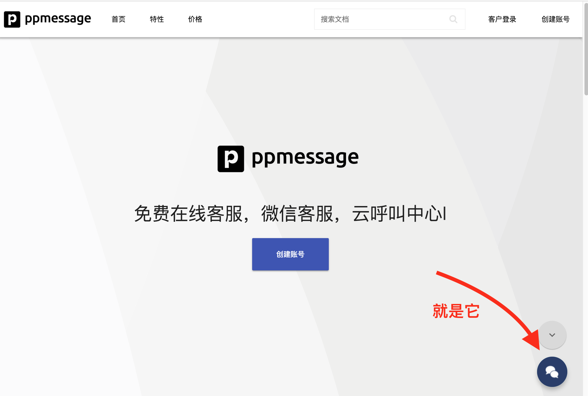
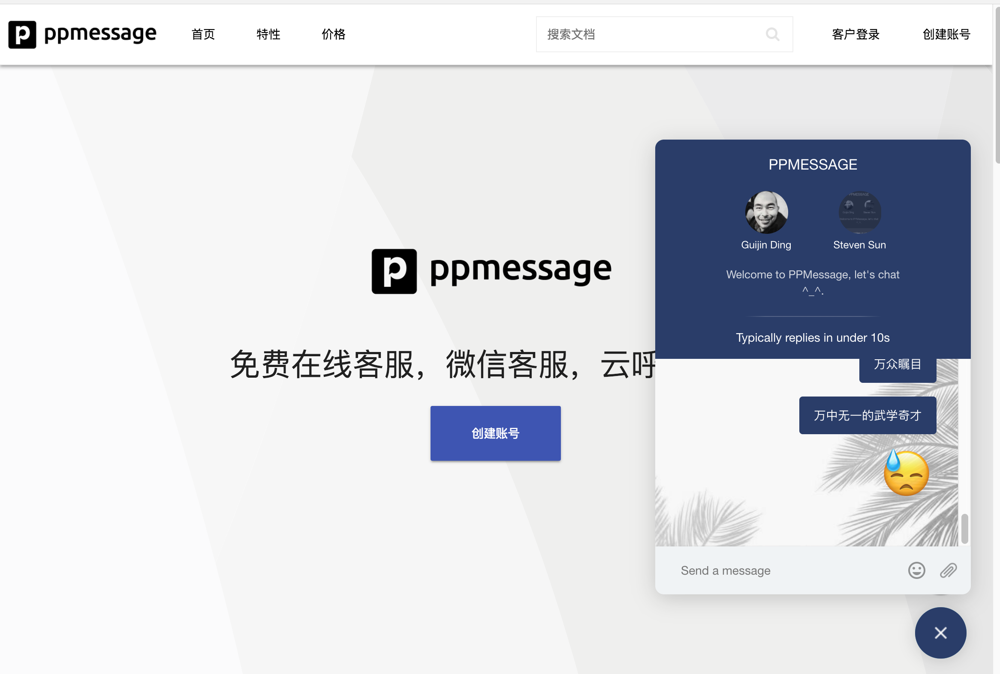
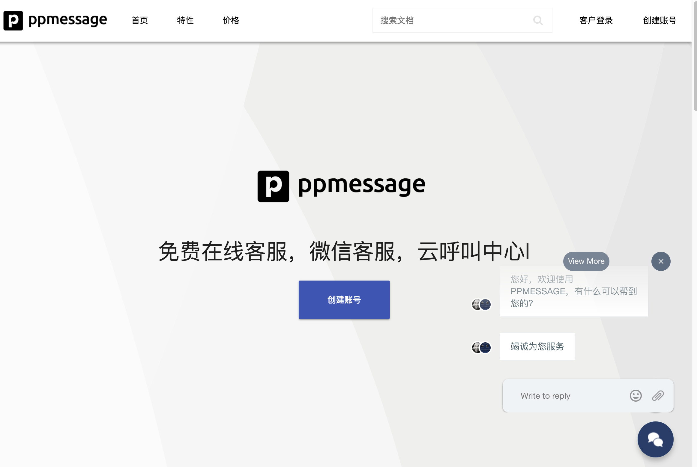

# 个人设置

> 可以设置座席个人信息

## 聊天按钮

访问 [PPMESSAGE 中文网站](https://ppmessage.cn)， 网站右下角将会弹出一个聊天按钮图标。

## 开始会话

点击这个图标，会打开聊天窗口，在窗口下方的输入栏里输入文字，Enter（回车键）即可发送消息。

现在你应该可以收到客服的回复了:)。除了文字，还支持发送图片、文件和表情。

## 会话发起模式

支持两种会话发起模式，一种由访客发起，另一种由客服人员发起，上述的是由访客发起会话的情形。

当客服人员发起会话的时候，访客看到的界面略有不同：

在这种模式下，访客可以马上回复客服人员的信息，整个界面半透明。之所以这样设计两种模式，是期望客服人员发起的会话对访客的干扰最小，避免对访客的过渡入侵。
这时候如果访客点击聊天按钮图标将进入访客发起会话模式的界面。

## 界面元素

### 聊天按钮

聊天按钮有两种状态，一种是在聊天窗口没有打开时候，一种是聊天窗口已经打开时。
当聊天窗口打开时候，聊天按钮自动变成关闭按钮，这样设计的目的可以让访客的鼠标在原来的位置即可以将聊天窗口关闭。

另外细心的读者可能已经发现，在刚刚加载网站的时候，聊天按钮的颜色进行了一次改变，并且还有一个动画效果。这个是聊天按钮的定制功能，我们会在下文中描述。

### 访客发起会话

访客发起会话的时候，会在聊天按钮的正上方弹出聊天窗口。

整个聊天窗口分成三部分：

* 会话窗口标题栏
* 会话窗口内容栏
* 会话窗口输入栏

#### 标题栏

标题栏显示当前会话的座席，最多显示三个，优先显示在线的客服。

标题栏有两种模式，一种高度比较大，一种高度比较小。大一点的显示的内容多一些：

* 团队名称
* 客服的头像、名称
* 团队欢迎语
* 系统预测的座席回复时间

点击标题栏会触发两种模式交替显示，如果访客开始输入信息，那么标题栏自动切换为高度较小的模式，这样设计的目的是为了让出更多的空间进行消息会话。

在高度较大的模式下，如果当前客服不在线，客服的头像会变灰色。
鼠标浮动在客服头像上会显示客服人员自己写的签名档，这样可以让客户对面前的客服有更多的了解。

#### 内容栏

在内容栏里面，左侧显示客服人员发送给访客的消息，同时显示座席人员的头像，最多显示三个座席人员的头像。
右侧是访客自己发送的信息。

#### 输入栏

输入栏由输入框，表情按钮，文件按钮组成。当访客有信息输入时候，文件按钮自动变成发送按钮。

> 整个访客界面支持文件拖放，如果从操作系统的文件管理器中拖过来一个文件，那么整个对话的界面会有一个虚线高亮，表示可以放在此处。

### 客服发起会话

在客服发起会话的模式下，访客可以选择点击输入框马上回复，也可点击关闭按钮，关闭聊天界面，忽略客服的信息。当点击了聊天按钮后将进入访客发起会话的界面。

## 定制界面

访客的界面支持两种定制方式：

* 通过前端 Javascript 定制，调用 PPMESSAGE 的接口和传递不同的参数信息，这些接口和参数信息将在开发篇进行描述。通过调用接口和传递不同参数可以重新定位聊天窗口的位置，可以隐藏聊天按钮。

* 通过后端消息流程进行定制，流程定制根据访客的上下文，进行标题栏的定制，整体颜色，背景图，聊天按钮动画，座席回复时间预测的定制。具体使用方法将在使用篇中进行阐述。

